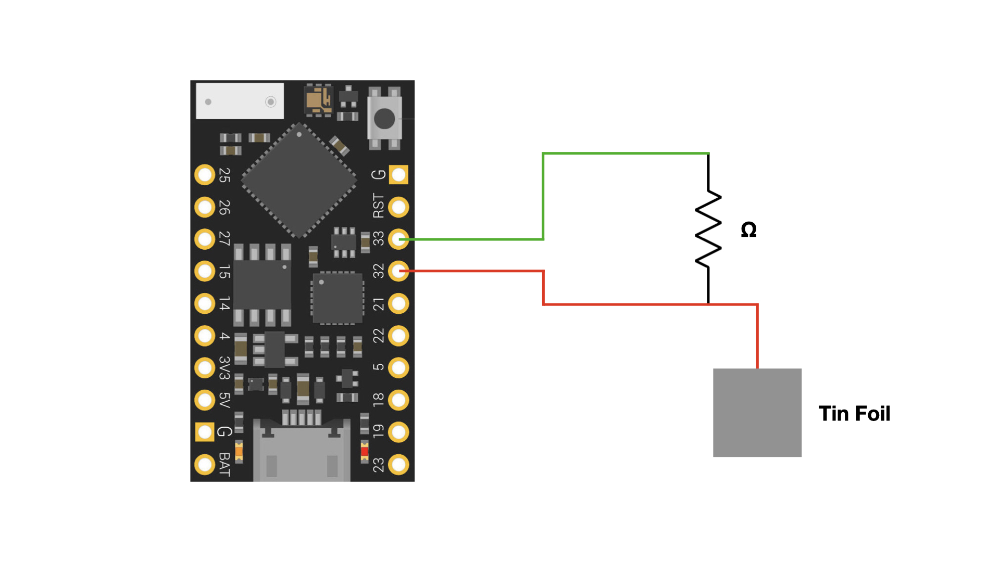

# Capacitive Sensing Tests

Given that the 1.3" Adafruit displays used for prototyping ReConstructibles are not touch-screens, we explored ways of simulating touch input.
One method is to embed custom capacitive sensors beneath the display.
Capacitive sensing is commonly used in multi-touch displays, such as smartphones.

This documents outlines the procedure for building a capacitive sensor using tin foil.
The sensor can be adjusted to detect direct touch contact or proximity.
At the end of the document, we describe what we learned from testing the sensor.

## Materials Needed

- TinyPICO control board
- 1 Mohm, 10 Mohm, 20 Mohm resistors
- alligator clips
- sheet of tin foil
- jumper wires
- breadboard

## Setup 

Wire up the TinyPICO, resistor, and tin foil on the breadboard according to the above schematic.
Use alligator clips to connect the tin foil to the circuit for a better connection.

## Procedure
- Compile [`capsense-test.ino`](./capsense-test/capsense-test.ino) and upload to the TinyPICO
- Open the Arduino Serial console
- The stream of numbers in the console represent the value of the sensor
- Touching the tin foil pad will cause the sensor value to spike
- Test each resistor value and explore how the sensor detects direct contact and proximity
- Test various tin foil sheet sizes to explore how that changes sensitivity and latency

## Results

Capacitive sensitivity and sensor latency is determined by the resistor value and surface area of the tin foil pad.
Low resistance or small surface area results in lower sensitivity and lower latency.
    - Ex: With 1 Mohm resistor, sensor detects only direct contact and responds quickly
High resistance or large surface area results in higher sensitivity and higher latency.
    - Ex: With 20 Mohm resistor, sensor detects proximity within a few cm, not just direct contact, but has slower response than 1 Mohm

